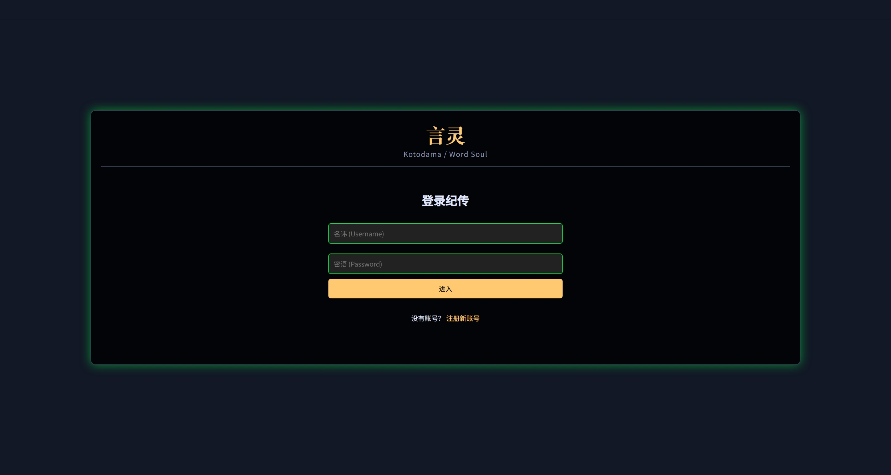
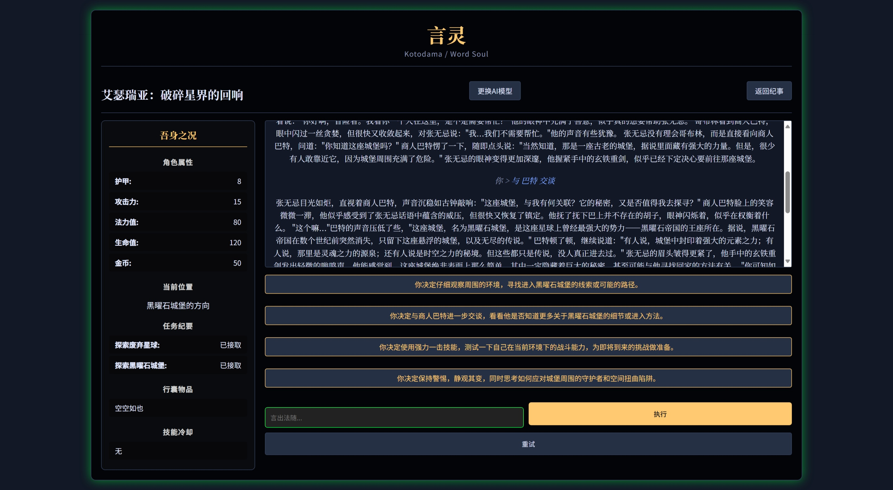

# 言灵 (Kotodama / Word Soul)

**一个以“语言创造世界”为核心的网页版文字冒险游戏平台。**

本项目由 [RewrZ (Rewrite;Zeroth / 终极改写)](https://rewrz.com) 开发，旨在为用户提供一个强大的工具，将无垠的想象力转化为可玩的、由AI驱动的动态叙事体验。在“言灵”的世界里，你既是玩家，也是创世神。

---





---

## 核心理念

*   **言出法随:** 用户的文字是平台内唯一的创造与交互工具。你的每一个输入，都在塑造着世界的走向。
*   **世界之灵:** 人工智能（AI）在系统中扮演着“世界之灵”的角色。它不仅是游戏主持人（GM），更是一个有原则、有风格的叙事者，守护着每个故事的基调与逻辑连贯性。
*   **沉浸式仪式感:** 产品的交互设计追求一种简约、专注、富有仪式感的体验。

## 主要功能

- **动态世界创造:** 通过结构化的表单，用户可以详尽定义世界的名称、核心规则、角色背景、初始场景和叙事风格，为AI提供清晰的创作蓝图。
- **AI驱动的叙事:** 游戏进程完全由大语言模型（LLM）驱动。AI作为游戏主持人（GM），能够根据你的设定和行动，生成生动的剧情描述和合乎逻辑的后续选项。
- **高自由度交互 (言灵交互台):** 告别死板的选项。玩家既可以从AI提供的建议中选择，也可以在交互台中输入完全自定义的行动指令，享受真正的自由。
- **多存档管理 (言灵纪事):** 支持用户创建并管理多个完全不同的世界和游戏存档。你可以随时在它们之间切换、继续冒险，或是删除旧的记录。
- **安全的用户系统:** 基于JWT（JSON Web Tokens）的无状态认证机制，有效保障用户账户和游戏数据的安全。
- **简约沉浸的UI:** 采用深色主题，搭配具有人文气息的字体，为你营造一个专注、神秘且富有想象力的游戏氛围。

## 技术栈

- **后端:** Python, Flask
- **数据库:** SQLite
- **前端:** HTML, CSS, JavaScript (原生JS)
- **认证:** Flask-JWT-Extended
- **数据库迁移:** Flask-SQLAlchemy, Flask-Migrate
- **AI核心:** 可插拔的AI服务模块，轻松切换不同的AI提供商（如 OpenAI, Gemini, Claude, 或本地模型）。

## 部署与运行

请确保您的系统中已安装 Python 3.8+ 和 pip。

1.  **克隆仓库:**
    ```bash
    git clone https://github.com/rewrz/word_soul.git
    cd word_soul
    ```

2.  **创建并激活虚拟环境:**
    ```bash
    # Windows
    python -m venv .venv
    .venv\Scripts\activate
 
    # macOS / Linux
    python3 -m venv .venv
    source .venv/bin/activate
    ```
 
3.  **安装依赖:**
    ```bash
    pip install -r requirements.txt
    ```
 
4.  **一键安装与初始化:**
    运行以下命令。它会自动生成必要的配置文件 (`.env`) 和密钥，并初始化数据库。
    ```bash
    python setup.py
    ```
    *此脚本会创建 `.env` 文件并填入 `SECRET_KEY` 和 `JWT_SECRET_KEY`，同时会添加AI配置的占位符。*
 
5.  **配置大模型API:**
    编辑刚刚生成的 `.env` 文件，根据您的需求填入AI模型的API密钥等信息。
    ```env
    # --- Flask App Configuration ---
    SECRET_KEY='...'
    JWT_SECRET_KEY='...'

    # --- AI Provider Configuration ---
    # 选择一个提供商 (Choose one provider): openai, gemini, claude, local_openai
    AI_PROVIDER='local_openai'

    # --- API Keys & Endpoints ---
    # 根据你选择的提供商，填写对应的密钥和URL
    OPENAI_API_KEY='...'
    # 如果使用本地模型或代理，请设置此项
    OPENAI_API_BASE_URL='http://localhost:1234/v1' 
    GEMINI_API_KEY='...'
    CLAUDE_API_KEY='...'
    ```
 
6.  **运行应用:**
    ```bash
    flask run
    ```
    应用现在应该运行在 `http://127.0.0.1:5000`。

### 生产环境部署

`flask run` 命令启动的是一个开发服务器，不适合在生产环境中使用。在生产环境中，您应该使用生产级的 WSGI 服务器，例如 Gunicorn 或 uWSGI，以获得更好的性能、稳定性和安全性。

**重要提示:** Gunicorn 和 uWSGI 仅支持类 Unix 系统 (如 Linux, macOS)。对于 Windows 用户，推荐使用 Waitress 等跨平台服务器。

以下是使用 **Gunicorn** (适用于 Linux/macOS) 部署的示例步骤：

1.  **安装 Gunicorn:**
    ```bash
    pip install gunicorn
    ```

2.  **使用 Gunicorn 启动应用:**
    在项目根目录下运行以下命令：
    ```bash
    # -w 4: 启动 4 个工作进程 (worker processes)，通常建议设置为 (2 * CPU核心数) + 1
    # -b 0.0.0.0:5000: 绑定到所有网络接口的 5000 端口
    # run:app: 指定 WSGI 应用实例 (在 run.py 中定义的 app)
    gunicorn -w 4 -b 0.0.0.0:5000 run:app
    ```
    为了让应用在后台持续运行，您可能需要结合使用进程管理工具，如 `supervisor` 或 `systemd`。

### 使用 systemd 管理 Gunicorn

在 Linux 系统中，推荐使用 `systemd` 来管理 Gunicorn 进程，以实现开机自启、进程守护和统一日志管理。

1.  **创建服务文件:**
    使用 `sudo` 创建一个服务文件，例如 `sudo nano /etc/systemd/system/word_soul.service`，并填入以下内容：

    ```ini
    [Unit]
    Description=Gunicorn instance to serve Word Soul
    After=network.target

    [Service]
    # 替换为运行此应用的用户名和用户组
    User=your_user
    Group=your_group
    # 替换为项目的绝对路径
    WorkingDirectory=/path/to/word_soul
    # 指定虚拟环境的路径，确保 Gunicorn 命令能被找到
    Environment="PATH=/path/to/word_soul/.venv/bin"
    # 启动命令，绑定到本地端口，通常由 Nginx 等反向代理来对外暴露
    ExecStart=/path/to/word_soul/.venv/bin/gunicorn --workers 4 --bind 127.0.0.1:5000 run:app
    Restart=always

    [Install]
    WantedBy=multi-user.target
    ```
    **重要提示:** 请务必将 `User`、`Group` 和所有 `/path/to/word_soul` 替换为您的实际用户名、用户组和项目绝对路径。

2.  **启动并启用服务:**
    ```bash
    # 重新加载 systemd 配置
    sudo systemctl daemon-reload
    # 启动服务
    sudo systemctl start word_soul
    # 设置开机自启
    sudo systemctl enable word_soul
    ```

3.  **管理服务:**
    ```bash
    # 查看服务状态
    sudo systemctl status word_soul
    # 停止服务
    sudo systemctl stop word_soul
    # 查看服务日志
    sudo journalctl -u word_soul -f
    ```

### 使用 uWSGI 部署 (适用于 Linux/macOS 的备选方案)

uWSGI 是另一个功能强大、性能卓越的生产级 WSGI 服务器。

1.  **安装 uWSGI:**
    ```bash
    pip install uwsgi
    ```

2.  **创建 uWSGI 配置文件:**
    在项目根目录下创建 `uwsgi.ini` 文件：
    ```ini
    [uwsgi]
    module = run:app

    master = true
    processes = 4

    socket = /path/to/word_soul/word_soul.sock
    chmod-socket = 660
    vacuum = true

    venv = /path/to/word_soul/.venv
    die-on-term = true
    ```
    **重要提示:** 请务必将所有 `/path/to/word_soul` 替换为您的项目绝对路径。

3.  **创建 systemd 服务文件:**
    创建 `/etc/systemd/system/word_soul.service` 并填入以下内容（如果已有 Gunicorn 的配置，请先备份或删除）：
    ```ini
    [Unit]
    Description=uWSGI instance to serve Word Soul
    After=network.target

    [Service]
    User=your_user
    Group=www-data
    WorkingDirectory=/path/to/word_soul
    ExecStart=/path/to/word_soul/.venv/bin/uwsgi --ini uwsgi.ini --py-autoreload 1
    Restart=always

    [Install]
    WantedBy=multi-user.target
    ```
    **重要提示:** 确保 `User` 和 `Group` 设置正确，以便 Nginx 有权限访问 socket 文件。然后使用 `sudo systemctl start word_soul` 和 `sudo systemctl enable word_soul` 启动服务。

### 使用 Waitress 部署 (适用于 Windows)

Waitress 是一个纯 Python 的生产级 WSGI 服务器，它在 Windows 上运行良好。

1.  **安装 Waitress:**
    ```bash
    pip install waitress
    ```

2.  **使用 Waitress 启动应用:**
    在项目根目录下运行以下命令：
    ```bash
    waitress-serve --host=0.0.0.0 --port=5000 run:app
    ```
    这会直接在前台启动应用。对于生产环境，您可能需要将其配置为 Windows 服务以实现后台运行和开机自启。

### 配置 Nginx 作为反向代理

在生产环境中，直接将 Gunicorn 暴露给公网是不安全的。推荐使用 Nginx 作为反向代理，来处理外部请求、提供静态文件并增强安全性。

1.  **修改 Gunicorn 绑定方式 (可选但推荐):**
    为了获得更好的性能和安全性，建议让 Gunicorn 监听一个 Unix socket 而不是 TCP 端口。修改你的 `systemd` 服务文件 (`/etc/systemd/system/word_soul.service`) 中的 `ExecStart` 行：
    ```diff
    - ExecStart=/path/to/word_soul/.venv/bin/gunicorn --workers 4 --bind 127.0.0.1:5000 run:app
    + ExecStart=/path/to/word_soul/.venv/bin/gunicorn --workers 4 --bind unix:/path/to/word_soul/word_soul.sock run:app
    ```
    修改后，重载并重启服务：`sudo systemctl daemon-reload && sudo systemctl restart word_soul`。

2.  **创建 Nginx 站点配置文件:**
    创建一个新的 Nginx 配置文件，例如 `sudo nano /etc/nginx/sites-available/word_soul`。
    ```nginx
    server {
        listen 80;
        # 将 your_domain.com 替换为你的域名或服务器IP
        server_name your_domain.com;

        # 将所有动态请求转发给后端的 WSGI 服务器
        location / {
            # --- 请根据您选择的 WSGI 服务器，取消注释对应的配置块 ---

            # 如果使用 uWSGI，请使用下面这两行:
            include uwsgi_params;
            uwsgi_pass unix:/path/to/word_soul/word_soul.sock;

            # 如果使用 Gunicorn，请注释掉上面的 uWSGI 配置，并使用下面这两行:
            # include proxy_params;
            # proxy_pass http://unix:/path/to/word_soul/word_soul.sock;
        }

        # Nginx 直接提供静态文件服务，效率更高
        location /static {
            # 项目中 static 文件夹的绝对路径
            alias /path/to/word_soul/app/static;
            expires 30d;
            add_header Cache-Control "public";
        }
    }
    ```
    **重要提示:** 请务必将 `your_domain.com` 和所有 `/path/to/word_soul` 替换为您的实际配置。

3.  **启用配置并重启 Nginx:**
    ```bash
    # 启用新的站点配置
    sudo ln -s /etc/nginx/sites-available/word_soul /etc/nginx/sites-enabled/
    # 测试配置语法是否正确
    sudo nginx -t
    # 重启 Nginx 使配置生效
    sudo systemctl restart nginx
    ```

### 添加 SSL/TLS 支持 (HTTPS)

为了保障网站安全，强烈建议为你的域名启用 HTTPS。最简单的方式是使用 **Let's Encrypt** 提供的免费证书和 **Certbot** 工具。

**前提条件:**
*   你拥有一个域名。
*   该域名的 A 记录已指向你服务器的公网 IP。
*   服务器防火墙已开放 80 和 443 端口。

1.  **安装 Certbot (以 Ubuntu 为例):**
    ```bash
    sudo apt update
    sudo apt install certbot python3-certbot-nginx
    ```

2.  **获取并安装证书:**
    将 `your_domain.com` 替换为你的实际域名。Certbot 会自动检测并修改你的 Nginx 配置。
    ```bash
    sudo certbot --nginx -d your_domain.com
    ```
    按照提示操作，建议选择将所有 HTTP 流量重定向到 HTTPS。

3.  **验证自动续期:**
    Certbot 会自动设置证书续期。你可以通过以下命令测试续期是否正常工作：
    ```bash
    sudo certbot renew --dry-run
    ```

## 使用说明

1.  **注册与登录:** 打开 `http://127.0.0.1:5000`，在首页使用“初入此界”表单注册一个新账户，然后登录。
2.  **创建世界:** 登录后，您会看到“言灵纪事”界面。点击“咏唱创世之言”按钮，进入创世表单。
3.  **填写创世表单:**
    - **此界之名:** 为你的世界命名。
    - **吾身之形:** 详细描述你将扮演的角色。
    - **万物之律:** 设定世界的核心规则、物理法则、魔法体系等。
    - **初始之景:** 描述游戏开始时的具体场景和氛围。
    - **叙事原则:** 定义故事的基调（例如：英雄史诗、黑暗奇幻、赛博朋克、轻松日常等）。
4.  **开始冒险:** 点击“创造世界”后，系统将根据你的设定生成世界，并直接进入游戏界面。AI会根据你的“初始之景”生成开场白。
5.  **交互:** 你可以通过底部的“言灵交互台”输入任意行动指令（如“我拔出剑，警惕地环顾四周”），或直接点击AI提供的建议选项来推动故事发展。
6.  **返回与继续:** 你可以随时点击界面右上角的“返回纪事”按钮回到主菜单。你的游戏进度会自动保存，下次在主菜单点击对应的存档即可无缝继续。

## API 接口说明

所有需要认证的接口都需要在请求头中包含 `Authorization: Bearer <your_jwt_token>`。

| 路径 (Endpoint) | 方法 (Method) | 描述 (Description) | 需要认证 (Auth Required) |
| :--- | :--- | :--- | :--- |
| `/api/register` | `POST` | 注册新用户 | 否 |
| `/api/login` | `POST` | 用户登录，获取JWT | 否 |
| `/api/logout` | `POST` | 用户登出 | 否 |
| `/api/sessions` | `GET` | 获取当前用户的所有游戏存档 | **是** |
| `/api/worlds` | `POST` | 创建一个新世界和游戏存档 | **是** |
| `/api/sessions/<id>/action` | `POST` | 在指定存档中执行一个动作 | **是** |
| `/api/sessions/<id>` | `DELETE` | 删除一个指定的游戏存档 | **是** |

### `POST /api/worlds` 请求体示例
```json
{
    "world_name": "艾泽拉斯",
    "character_description": "一名被遗忘的圣骑士，在圣光与暗影的边缘挣扎。",
    "world_rules": "这是一个充满魔法与冲突的世界。联盟与部落的战争从未停息，古老的邪神在暗中窥伺。",
    "initial_scene": "我在一个破败的教堂中醒来，身上只有一件破旧的布衣，手中紧握着一枚褪色的圣徽。",
    "narrative_principles": "一个关于救赎与牺牲的英雄史诗，基调严肃，充满挑战。"
}
```

### `POST /api/sessions/<id>/action` 响应体示例
```json
{
    "description": "你用力推开沉重的石门，刺眼的阳光让你不禁眯起了眼睛。门外是一片被战争蹂躏的废墟，远方传来野兽的嚎叫。",
    "player_message": "你的体力似乎有所消耗。",
    "add_item_to_inventory": null,
    "remove_item_from_inventory": null,
    "update_quest_status": "主线任务:探索这个世界",
    "suggested_choices": [
        "走向废墟深处",
        "检查教堂周围的环境",
        "大声呼喊，看是否有人回应"
    ]
}
```

## 未来展望

- **世界分享:** 允许玩家将自己创造的“世界蓝图”分享给其他玩家游玩。
- **多人协同:** 探索允许多个玩家在同一个世界中进行冒险的可能性。
- **多模态升级:** 在可选的“高级模式”中，引入AI图片生成功能，为关键场景生成匹配的插图。

## 许可协议

本项目采用 MIT 许可协议。详情请见 [LICENSE](LICENSE) 文件。